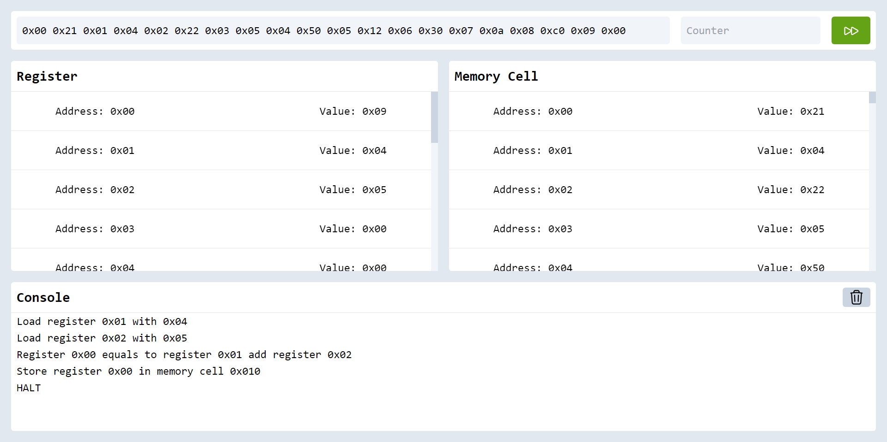

# Vole Language Simulator

## Website

Click [here](https://vole-language-simulator.netlify.app/) to visit the website

## How to use it

### Basic

Put the program in the **Program** blank then click the green play button, the simulator will work

input the Memory cell address then the hexadecimal value
which means 2 memory cell represents 1 instruction

```
0x00 0x21 0x01 0x04 0x02 0x22 0x03 0x05 0x04 0x50 0x05 0x12 0x06 0x30 0x07 0x0a 0x08 0xc0 0x09 0x00
```

Try the program above, you should find register 0 and memory cell 0x0a are 0x09



### Start address

Type the start address in **counter** blank if you want to set the entry address of the program

The website will set the first not 0x00 memory cell address as the counter by default

